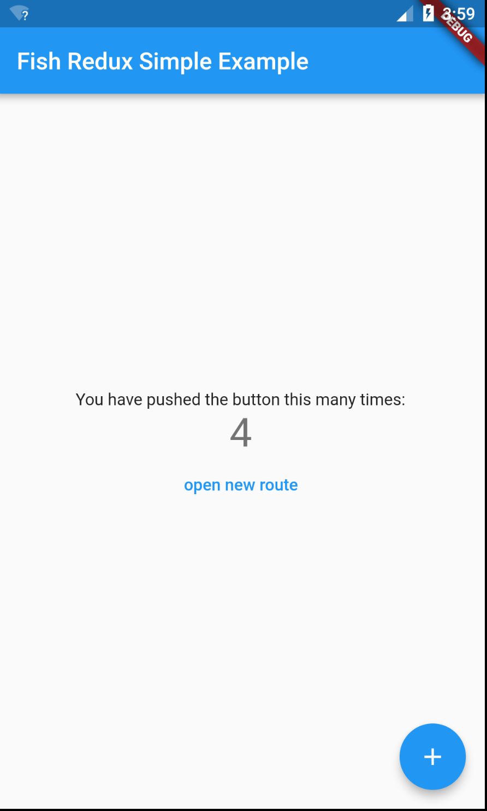
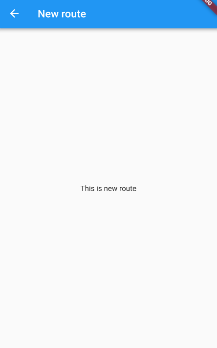

# Fish Redux实战

## 1.示例效果
程序计数器页面


新路由跳转页面



## 代码

新建flutter项目，在pubspec.yaml文件中添加依赖

```yaml
fish_redux: ^0.1.6
```

在lib目录下新建Fish Redux模板(安装模板插件[Android Studio](<https://github.com/BakerJQ/FishReduxTemplateForAS>)、[vscode](<https://github.com/huangjianke/fish-redux-template>))

