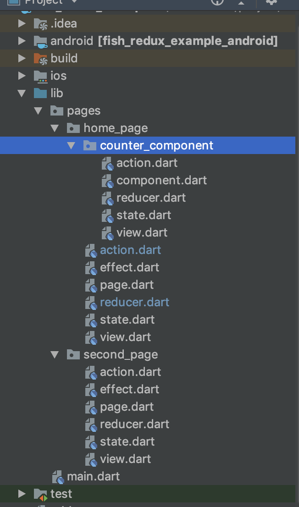

# Fish Redux实战

## 1.示例效果    

程序计数器页面    
   

新路由跳转页面   

    

## 代码    

新建flutter项目，在pubspec.yaml文件中添加依赖

```yaml
fish_redux: ^0.1.6
```

在lib目录下新建Fish Redux模板(安装模板插件[Android Studio](<https://github.com/BakerJQ/FishReduxTemplateForAS>)、[vscode](<https://github.com/huangjianke/fish-redux-template>)),如图生成模板：



counter_component是程序计数器的组件，关于component的[官方说法](<https://github.com/alibaba/fish-redux/blob/master/doc/concept/component-cn.md>)，其实相当于将页面的各个组件进行拆分成相互独立的单元。

在**counter_component**中

1 首先，在state.dart文件中，创建页面状态类，包含标题和内容数据，状态类必须实现Cloneable接口

```dart
import 'package:fish_redux/fish_redux.dart';

class CounterState implements Cloneable<CounterState> {

  int counter;

  CounterState({this.counter = 0});

  @override
  CounterState clone() {
    return CounterState()..counter = counter;
  }

  @override
  String toString() {
    return 'CounterState{counter: $counter}';
  }
}
```

2. Action 文件

```dart
import 'package:fish_redux/fish_redux.dart';

//TODO replace with your own action
enum CounterAction { update }

class CounterActionCreator {
  static Action updateCounterAction(int value) {
    return Action(CounterAction.update, payload: value);
  }
}
```

3 reducer文件中，reducer用于接收意图，该文件提供了Reducer，声明Reducer监听的action，实现监听到action的动作

```dart
import 'package:fish_redux/fish_redux.dart';

import 'action.dart';
import 'state.dart';

Reducer<CounterState> buildReducer() {
  return asReducer(
    <Object, Reducer<CounterState>>{
      CounterAction.update: _updateCounter,
    },
  );
}

CounterState _updateCounter(CounterState state, Action action) {
  final int newValue = action.payload ?? 0;
  final CounterState newState = state.clone();
  newState.counter = newValue;
  return newState;
}
```

5 view文件提供实现界面的方法

```dart
import 'package:fish_redux/fish_redux.dart';
import 'package:flutter/material.dart';
import '../action.dart';
import 'action.dart';
import 'state.dart';

Widget buildView(CounterState state, Dispatch dispatch, ViewService viewService) {
  return Scaffold(
    appBar: AppBar(
      title: Text("Fish Redux Simple Example"),
    ),
    body: Center(
      child: Column(
        mainAxisAlignment: MainAxisAlignment.center,
        children: <Widget>[
          Text(
            'You have pushed the button this many times:',
          ),
          Text(
            '${state?.counter ?? 0}',
            style: Theme.of(viewService.context).textTheme.display1,
          ),
          FlatButton(
            child: Text("open new route"),
            textColor: Colors.blue,
            onPressed: () {
              dispatch(HomeActionCreator.openSecond());
            },
          ),
        ],
      ),
    ),
    floatingActionButton: FloatingActionButton(
      onPressed: () {
        dispatch(
            CounterActionCreator.updateCounterAction((state?.counter ?? 0) + 1));
      },
      tooltip: 'Increment',
      child: Icon(Icons.add),
    ),
  );
}
```

5 在component中注册

```dart
import 'package:fish_redux/fish_redux.dart';

import 'reducer.dart';
import 'state.dart';
import 'view.dart';

export 'state.dart'; //将自己组件内的状态对外暴露接口

class CounterComponent extends Component<CounterState> {
  CounterComponent()
      :super(
    view: buildView,
    reducer: buildReducer(),
  );

}
```

在**home_page**目录里下

1 在state文件里，定义组件状态信息，赋值给HomeState

```dart
import 'package:fish_redux/fish_redux.dart';

import 'counter_component/component.dart';

class HomeState implements Cloneable<HomeState> {

  CounterState counterState;


  @override
  HomeState clone() {
    return HomeState()..counterState = counterState;;
  }
}

HomeState initState(Map<String, dynamic> args) {
  println('HomeState:initState');
  return HomeState()..counterState = CounterState();
}
// https://github.com/alibaba/fish-redux/blob/master/doc/concept/what's-connector.md
class CounterConnector extends ConnOp<HomeState, CounterState> {
  @override
  CounterState get(HomeState state) {
    return state.counterState;
  }

  @override
  void set(HomeState state, CounterState counterState) {
    state.counterState = counterState;
  }
}
```

2 action文件

```dart
import 'package:fish_redux/fish_redux.dart';
import 'counter_component/component.dart';
//TODO replace with your own action

enum HomeAction { initCounter,openSecond }

class HomeActionCreator {
  static Action initCounterAction(CounterState counterState) {
    println('Homeaction:initCounterAction');
    return  Action(HomeAction.initCounter, payload: counterState);
  }

  static Action openSecond() {
    return const Action(HomeAction.openSecond);
  }
}
```

3 effect文件

```dart
import 'package:fish_redux/fish_redux.dart';
import 'package:flutter/material.dart';
import 'action.dart';
import 'state.dart';
import 'counter_component/component.dart';
Effect<HomeState> buildEffect() {
  println('Effect: _update');
  return combineEffects(<Object, Effect<HomeState>>{
    Lifecycle.initState: _init,
    HomeAction.openSecond: _openSecond,
  });
}

void _init(Action action, Context<HomeState> ctx) {
  final CounterState counterState = new CounterState();

  ctx.dispatch(HomeActionCreator.initCounterAction(counterState));
}

void _openSecond(Action action, Context<HomeState> ctx) {
  println("_openSecond");
  Navigator.of(ctx.context)
      .pushNamed('second', arguments: null)
      .then((dynamic toDo) {

  });
}
```

4 Reducer 文件

```dart
import 'package:fish_redux/fish_redux.dart';

import 'action.dart';
import 'state.dart';
import 'counter_component/component.dart';
Reducer<HomeState> buildReducer() {
  println('Reducer:buildReducer');
  return asReducer(
      <Object, Reducer<HomeState>>{
    //这里添加要监听的Action
        HomeAction.initCounter: _init,  //HomeAction.initCounter
  });
}

HomeState _init(HomeState state, Action action) {
  println('HomeReducer:  _init');
  final CounterState counterState = action.payload ?? new CounterState();
  final HomeState newState = state.clone();
  newState.counterState = counterState;
  return newState;
}
```

5 view文件提供实现界面的方法

```dart
import 'package:fish_redux/fish_redux.dart';
import 'package:flutter/material.dart';

import 'action.dart';
import 'state.dart';

Widget buildView(HomeState state, Dispatch dispatch, ViewService viewService) {
  println('Homeview: buildView');
  return MaterialApp(
    title: 'Fish Redux Counter Example',
    theme: ThemeData(
      primarySwatch: Colors.blue,
    ),
    home: viewService.buildComponent('counter'),
  );
}
```

6 page中注册页面

```dart
import 'package:fish_redux/fish_redux.dart';

import 'effect.dart';
import 'reducer.dart';
import 'state.dart';
import 'view.dart';
import 'counter_component/component.dart';
class HomePage extends Page<HomeState, Map<String, dynamic>> {
  HomePage()
      : super(
            initState: initState,
            effect: buildEffect(),
            reducer: buildReducer(),
            view: buildView,
            dependencies: Dependencies<HomeState>(
                adapter: null,
                slots: <String, Dependent<HomeState>>{
                  'counter': CounterConnector() + CounterComponent()
                }),
            middleware: <Middleware<HomeState>>[
              logMiddleware(tag: 'HomePage',
                monitor: (HomeState state) {
                  return state?.counterState?.counter?.toString();
                },)
            ],);

}
```

7 全局main函数

```dart
import 'package:fish_redux/fish_redux.dart';
import 'package:flutter/material.dart';

import 'pages/home_page/page.dart';
import 'pages/second_page/page.dart';
void main() => runApp(MyApp());

class MyApp extends StatefulWidget {
  @override
  _MyAppState createState() => _MyAppState();
}

class _MyAppState extends State<MyApp> {
  @override
  Widget build(BuildContext context) {
    println('main');

    final AbstractRoutes routes = HybridRoutes(routes: <AbstractRoutes>[
      PageRoutes(
        pages: <String, Page<Object, dynamic>>{
          'main': HomePage(),
          'second': SecondPage(),
        },
      ),
    ]);

   return MaterialApp(
     home: routes.buildPage('main', null),//主页面
     onGenerateRoute: (RouteSettings settings) {
       return MaterialPageRoute<Object>(builder: (BuildContext context) {
         return routes.buildPage(settings.name, settings.arguments);
       });
     },
   );
  }

}
```

